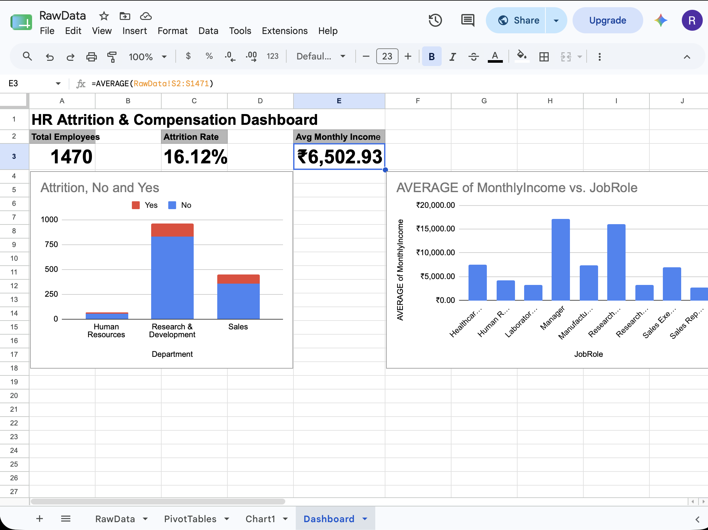

# HR Attrition & Compensation Dashboard

An Excel/Google Sheets dashboard analyzing employee attrition and compensation patterns using pivot tables, KPI cards, and charts, built on the IBM HR Analytics Employee Attrition dataset (1,470 employees).

## 🔗 Live Dashboard

[View Interactive Dashboard on Google Sheets](https://docs.google.com/spreadsheets/d/1Jm5aRIThziT8pf7Zkq9kb--BWV5JvvHRhX19uIf8UGM/edit?usp=sharing)

## Tools Used

- Google Sheets (Pivot Tables, KPI formulas, Charts)
- Data cleaning (duplicate check, blank-value check, category consistency check)

## Key Insights

- Overall attrition rate is 16.1% across 1,470 employees
- Sales has the highest proportional attrition rate (~21%), followed by HR (~19%) and R&D (~14%)
- Average monthly income varies sharply by role — Managers and Research Directors earn the most, while Sales Representatives and Lab Technicians earn the least
- Average monthly income across the company is ₹6,502.93

## Dashboard Preview

## Dataset

[IBM HR Analytics Employee Attrition & Performance — Kaggle](https://www.kaggle.com/datasets/pavansubhasht/ibm-hr-analytics-attrition-dataset)
